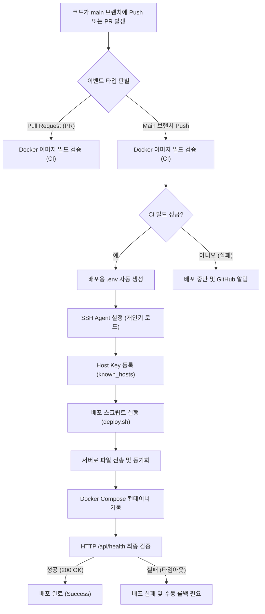

# CI/CD 워크플로우 매뉴얼 (GitHub Actions)

이 문서는 `pocketbase-toolkit` 프로젝트의 **CI/CD(지속적 통합 및 배포) 자동화 파이프라인**에 대한 구조와 상세 동작 방식을 설명합니다. 

이 프로젝트는 개발자가 `main` 브랜치에 코드를 푸시하거나 머지하는 것만으로, 빌드 오류 검증부터 서버 배포 및 구동 헬스체크까지의 전 과정을 자동으로 처리합니다.

---

## 1. 전체 워크플로우 개요



---

## 2. 세부 단계별 동작 가이드

### 단계 1: 워크플로우 트리거 (Trigger)
GitHub Actions 워크플로우 파일([.github/workflows/ci-cd.yml](../../.github/workflows/ci-cd.yml))은 다음의 Git 이벤트가 감지될 때 자동 실행됩니다.
* **Pull Request (PR)**: `main` 브랜치를 대상으로 PR이 생성되거나 새로운 커밋이 추가되면 **CI(빌드 검증) 단계만 수행**하여 코드 안전성을 체크합니다.
* **Push**: `main` 브랜치에 직접 푸시되거나 PR이 머지(Merge)되면 **CI 및 CD(배포) 단계를 전부 수행**합니다.

---

### 단계 2: CI (Build) - Docker 빌드 검증
배포를 수행하기 전, 가상 환경(`ubuntu-latest`)에서 프로젝트의 Dockerfile이 에러 없이 빌드되는지 먼저 테스트합니다.
1. **코드 체크아웃**: GitHub Actions 러너에 최신 소스 코드를 내려받습니다.
2. **Buildx 엔진 구성**: 고속 빌드와 캐시 관리를 지원하는 Docker Buildx 환경을 준비합니다.
3. **이미지 모의 빌드**: `docker/Dockerfile` 기준으로 가상의 컨테이너 이미지를 빌드합니다.
   > [!NOTE]
   > 빌드가 무사히 완료되는지만 검사하는 모의 단계이므로, 빌드된 이미지를 Docker Hub와 같은 외부 레지스트리에 업로드(`push`)하지는 않습니다.
   > 또한, 빌드 속도 향상을 위해 GitHub Actions 고유 캐시를 사용해 변경 없는 레이어 빌드를 빠르게 패스합니다.

---

### 단계 3: CD (Deploy) - 환경설정 및 SSH 접속 준비
CI 빌드 단계가 성공하고 `main` 브랜치 푸시 조건이 만족되면, 원격 서버와의 통신을 안전하게 셋업합니다.

1. **배포용 `.env` 파일 자동 생성**:
   GitHub의 `Secrets` 및 `Variables`에 저장해 둔 인프라 환경 변수들을 취합하여, 서버로 보낼 실시간 `.env` 파일을 로컬에 동적으로 생성합니다.
   * **주요 필수 필드 검사**: `PB_VERSION`, `PB_HOST_PORT`, `DOMAIN`, `PB_ADMIN_EMAIL`, `PB_ADMIN_PASSWORD`, `BACKUP_RETENTION_DAYS`
   * **필수값 누락 체크**: 생성된 `.env` 파일에 필요한 모든 키(Cloudflare 터널 토큰 포함)가 올바르게 기입되었는지 점검합니다.
2. **SSH Agent 기반 개인키 등록**:
   `webfactory/ssh-agent` 플러그인을 사용하여 보안에 매우 중요한 배포용 SSH 키(`DEPLOY_SSH_KEY`)를 메모리 에이전트에 등록합니다. 
   > [!TIP]
   > 임시 파일에 키를 직접 복사하여 사용하는 방식보다 줄바꿈 인코딩 깨짐이나 포맷 에러(RSA, Ed25519)로부터 안전합니다.
3. **Known Hosts 사전 차단 예방**:
   `ssh-keyscan` 명령을 수행하여 배포 대상 서버(`DEPLOY_HOST`)의 공개 키 지문(Fingerprint)을 Actions 러너 환경의 `~/.ssh/known_hosts` 파일에 미리 등록합니다. 배포 중 "이 호스트를 신뢰합니까? (yes/no)"와 같은 대화식 확인 인터럽트가 생겨 배포가 멈추는(Hang) 현상을 차단합니다.

---

### 단계 4: CD (Deploy) - 원격 서버 배포 및 헬스체크
준비가 끝나면 Actions에서 배포 스크립트([scripts/deploy.sh](../../scripts/deploy.sh))를 기동하여 타깃 서버에 직접 명령을 내립니다.

1. **로컬 릴리즈 압축**:
   * 로컬 빌드 경로에서 불필요한 파일(`.git`, `.github` 등)을 제외하고 소스 코드와 자산들을 하나의 압축 파일(`release.tar.gz`)로 묶습니다.
2. **서버 복사 및 압축 해제**:
   * `scp`를 통해 압축 파일을 서버의 배포 지정 디렉토리(`DEPLOY_PATH`)로 보낸 후, 원격 `tar` 명령어로 압축을 해제합니다.
3. **`.env` 강제 동기화**:
   * Actions 단계에서 동적으로 생성했던 `.env` 파일을 서버에 강제 덮어쓰기(`FORCE_SYNC_ENV=1`)하여 서버 설정값을 최신 상태로 강제 일치시킵니다.
4. **컨테이너 재생성 및 구동**:
   * `docker-compose.yml` + `docker-compose.prod.yml` 조합으로 컨테이너 환경을 갱신합니다. PocketBase 서비스와 함께 터널(Cloudflare Edge 연동), 자동 백업 스케줄러(Ofelia) 데몬이 함께 구동됩니다.
5. **최종 서비스 헬스체크**:
   * 컨테이너가 뜬 이후, 호스트 포트(`PB_HOST_PORT`) 기준의 `/api/health` 경로로 최대 60초(5초 간격, 총 12회 시도) 동안 통신을 찌릅니다.
   * `HTTP 200 OK` 상태 코드가 반환되면 비로소 배포 파이프라인 전체가 **최종 성공(Success)**으로 선언됩니다.

---

## 3. 배포 운영 시 참고 사항

> [!WARNING]
> **롤백 관리**
> 배포 스크립트가 실행된 후 60초간 헬스체크가 실패하면 배포가 취소(Exit 1)됩니다. 다만 Docker 컨테이너 구동 자체에서 이미 크래시가 났다면, GitHub Action 콘솔에 표시되는 실패 로그 및 다음의 서버 접속 명령을 확인하여 수동으로 롤백하거나 서버 상태를 점검해야 합니다:
> ```bash
> ssh <user>@<host> "cd <deploy-path> && docker compose logs -n 50"
> ```
